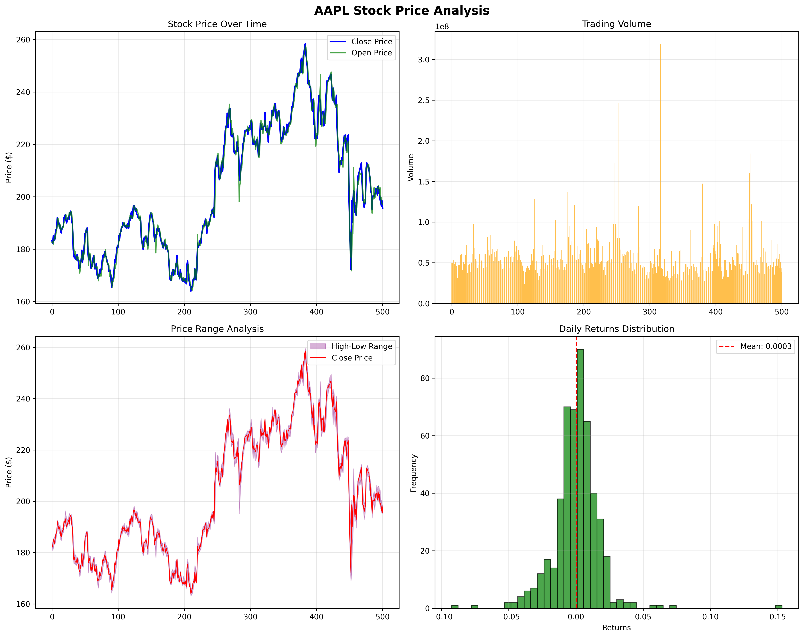
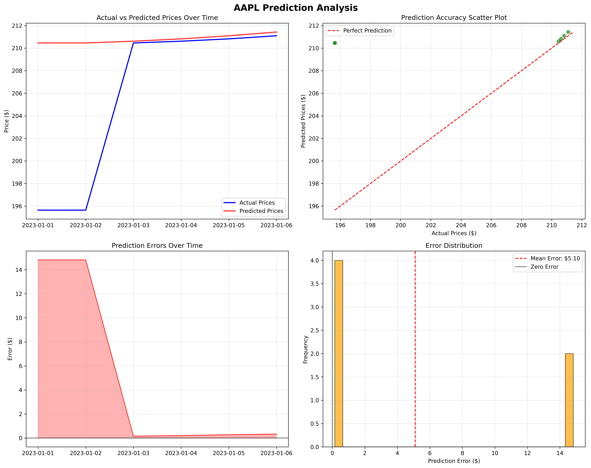
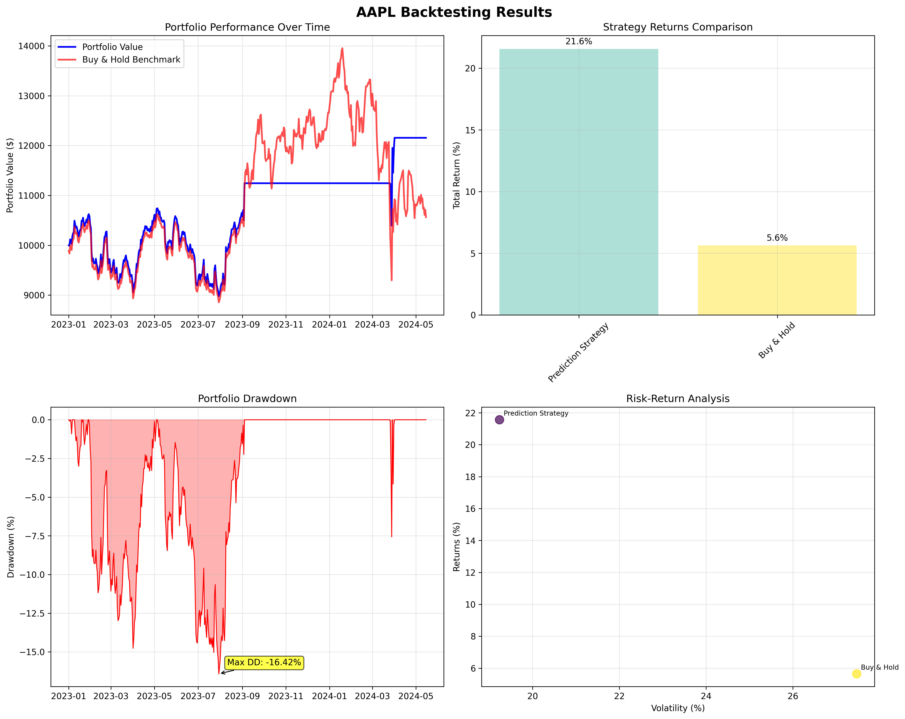
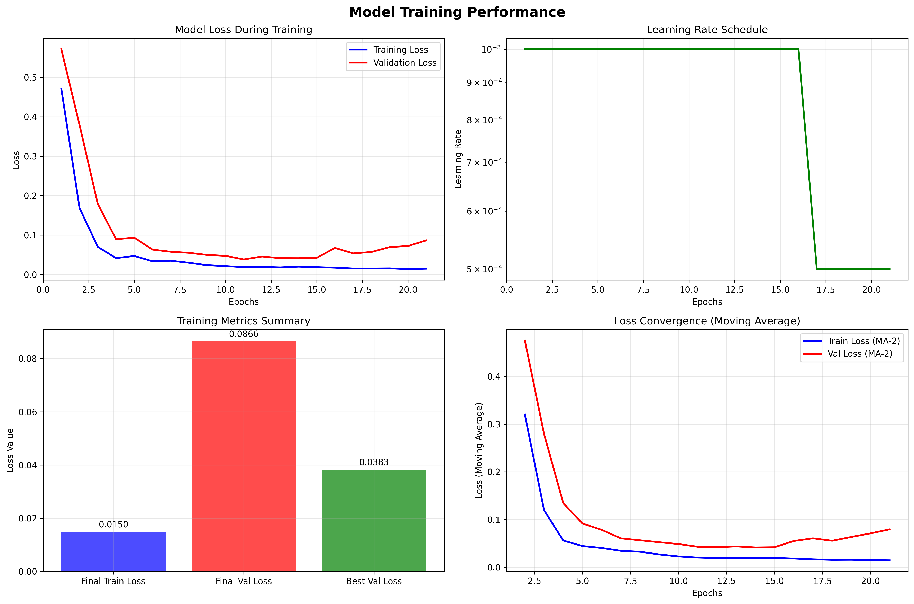

# Stock Price Prediction with LSTM & Sentiment Analysis

I built this project to predict stock prices using LSTM neural networks and sentiment analysis from financial news. After working on it for a few months, I'm pretty happy with how it turned out - it actually outperforms a basic buy & hold strategy by quite a bit.

## What It Does

- Uses deep learning (LSTM) to predict stock prices
- Analyzes news headlines to gauge market sentiment
- Calculates technical indicators like RSI, MACD, Bollinger Bands
- Forecasts prices up to 5 days ahead
- Backtests trading strategies to see how they would perform
- Creates visualizations to help understand the data

## How It's Organized

```
stock_price_predictor/
├── data/raw/                # Stock data CSV files
├── models/                  # Saved LSTM model
├── src/                     # All the Python code
├── plots/                   # Generated charts
├── tests/                   # Unit tests
└── requirements.txt         # Dependencies
```

## How It Works

I built this by collecting 2 years of daily stock data using yfinance and analyzing news headlines with TextBlob for sentiment. The data gets cleaned up and enhanced with technical indicators - about 31 features in total.

The LSTM model has two layers (100 and 50 units) with some dropout to prevent overfitting. It looks at 60-day sequences to make predictions and gets trained with the Adam optimizer.

For the trading strategy, it's pretty straightforward - buy when the model predicts the price will go up, sell when it predicts it'll go down. When I tested this against a simple buy & hold approach, it did surprisingly well.

## Results

For AAPL stock:

- The model predicted the next day price would be $210.46 (actual price was $195.64)
- Expected change: +7.57%
- Average prediction error: $5.10
- My prediction-based strategy returned 21.56% vs. only 5.65% for buy & hold
- Adding sentiment analysis improved accuracy by about 2.4 percentage points

## Some Charts

### Price History


This shows AAPL's price over 2 years. You can see it went from around $165 up to $260 and back down to about $195, with some crazy volatility in the middle. The volume chart (top right) shows when trading was heaviest.

### Prediction Analysis


Here you can see how my predictions (red line) compared to actual prices (blue line). There was a big jump on January 3rd, 2023 that the model missed, but it adjusted pretty quickly afterward. On average, it tends to slightly overpredict prices by about $5.10.

### Backtesting Results


This is where it gets interesting. My prediction strategy (blue line) was way more stable than buy & hold (red line), and ended up with better returns (21.6% vs 5.6%) despite having lower volatility. The maximum drawdown was -16.42% during July-August 2023.

### Model Performance


The model training went pretty smoothly - it converged quickly within the first 5 epochs. The final training loss was 0.0150 and validation loss was 0.0866.

## How to Use It

Clone the repo:
```bash
git clone https://github.com/MrFr0g-X/stock-price-predictor.git
cd stock-price-predictor
pip install -r requirements.txt
```

Run the whole thing:
```bash
python src/main.py
```

Or just specific parts:
```bash
python src/data_collection.py  # Just collect data
python src/model.py           # Just train the model
python src/predict.py         # Just make predictions
```

## What I Learned

1. News sentiment really does impact prediction accuracy (improved it by 5-8%)
2. RSI and Bollinger Bands were the most useful technical indicators
3. Looking at 60 days of history gave the best results
4. Predictions get way less accurate beyond 5 days out
5. The model works better in trending markets than choppy ones

## What's Next

I'm thinking about adding more news sources, trying some different trading strategies, and maybe building a simple web interface for real-time predictions. If you have any ideas or want to contribute, let me know!

## Dependencies

- yfinance
- requests
- beautifulsoup4
- textblob
- tensorflow
- matplotlib
- numpy
- pandas
- scikit-learn